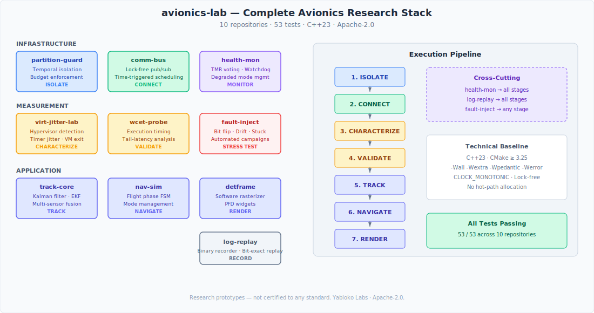

# Avionics Systems Lab

**Open-source prototyping and validation toolkit for avionics software concerns.**

This portfolio is intended for architecture exploration, timing characterization, virtualization overhead measurement, and deterministic rendering experiments in avionics-adjacent software contexts.

## Repositories

| Repository | Area | What It Does |
|-----------|------|-------------|
| [partition-guard](https://github.com/yablokolabs/partition-guard) | Partitioning | C++23 partitioned runtime prototype — temporal isolation, budget enforcement, health monitoring, restart policies, and lock-free IPC in userspace. Inspired by ARINC 653, not standards-compliant, not spatially isolated at the OS/MMU level |
| [comm-bus](https://github.com/yablokolabs/comm-bus) | Data Bus | Deterministic time-triggered data bus — lock-free pub/sub channels, periodic scheduling, typed avionics messages, freshness monitoring |
| [virt-jitter-lab](https://github.com/yablokolabs/virt-jitter-lab) | Virtualization | Hypervisor detection, timer jitter measurement, preemption analysis, IPC latency benchmarks, VM exit costing |
| [wcet-probe](https://github.com/yablokolabs/wcet-probe) | Timing Analysis | Low-overhead execution-time instrumentation, trace capture, tail-latency characterization |
| [track-core](https://github.com/yablokolabs/track-core) | State Estimation | Kalman filtering, extended Kalman filter, sensor simulation, sequential multi-sensor fusion |
| [detframe](https://github.com/yablokolabs/detframe) | Graphical Processing | Deterministic software rasterizer, PFD widgets, reproducible frame output, bounded render time |
| [fault-inject](https://github.com/yablokolabs/fault-inject) | Resilience Testing | Fault injection (bit flips, stuck, drift, noise, drops), range/rate monitoring, automated test campaigns |

## Architecture Overview



Each repository is self-contained and independently useful. Together, they address a pipeline of concerns that arise when building safety-aware embedded software:

1. **Isolate** — Run mixed-criticality workloads on shared hardware with temporal isolation, budget enforcement, and controlled partition boundaries in userspace. Fault containment ensures one partition's failure doesn't cascade.

2. **Connect** — Exchange data between partitions, sensors, and displays through a deterministic time-triggered bus. Fixed-size slots, lock-free publish/subscribe, periodic scheduling, freshness monitoring.

3. **Characterize** — Before deploying on a virtualized platform, measure the actual overhead: timer jitter, scheduling preemption, IPC latency, and hypervisor exit cost. Know the cost before committing.

4. **Validate** — Instrument critical code paths and characterize their execution-time distribution under stress. Identify tail latencies and outliers that might violate timing budgets.

5. **Track** — Estimate target state from noisy sensor measurements using Kalman filtering and multi-sensor fusion. The mathematical foundation for any system that needs to know where something is and where it's going.

6. **Render** — Produce avionics-style displays (PFDs) using a software rasterizer with no floating-point in the render path, reproducible output, and bounded frame times.

7. **Stress Test** — Inject faults (bit flips, stuck sensors, drift, noise, message drops) into any stage of the pipeline and measure how the system degrades. Automated campaigns with structured reporting.

## What This Is

- Research prototypes and validation tooling
- Architecture experiments and proof-of-concept software
- Benchmarking tools for understanding system behavior
- Engineering tools for making informed design decisions

## What This Is NOT

- Not certified to any standard (DO-178C, ARINC 653, etc.)
- Not production flight software
- Not a replacement for formal verification or static analysis
- Not classified, ITAR-controlled, or export-restricted

These are engineering tools. They help you understand behavior, prototype architectures, and build confidence in design decisions — before you enter formal development and certification.

## Technical Baseline

All repositories share a common engineering baseline:

| Property | Value |
|----------|-------|
| Language | C++23 |
| Build system | CMake ≥ 3.25 |
| Compilers | GCC ≥ 13, Clang ≥ 17 |
| Warnings | `-Wall -Wextra -Wpedantic -Werror` |
| Timing | `CLOCK_MONOTONIC` throughout |
| Hot path allocation | None after initialization |
| Data path locking | Lock-free where applicable |
| CI | GitHub Actions (GCC + Clang + sanitizers) |
| License | Apache-2.0 |
| Platform | Linux (x86_64) |

## Demo Scenario: Characterizing a Virtualized PFD Pipeline

A concrete use case connecting all four repositories:

**Goal:** Determine whether a virtualized Linux guest can reliably render a PFD at 60fps while running alongside lower-criticality workloads.

**Step 1: Set up the data bus**
```bash
cd comm-bus
./build/avionics_bus_demo
# → 4 ports: Nav (50Hz), Attitude (50Hz), Engine (10Hz), Health (2Hz)
# → 112 messages/second, lock-free pub/sub, zero allocation
```

**Step 2: Measure virtualization overhead**
```bash
cd virt-jitter-lab
./build/virt-jitter-lab --samples 50000 --sleep-us 500
# → Reveals: timer jitter, preemption spikes, VM exit cost
# → Decision: Is the hypervisor overhead compatible with a 16.67ms frame budget?
```

**Step 3: Isolate the rendering workload**
```bash
cd partition-guard
# Configure 3 partitions: PFD render (high), navigation (medium), logging (low)
# Run and verify zero budget overruns, measure IPC latency
```

**Step 4: Characterize render timing**
```bash
cd wcet-probe
# Instrument the PFD render function
# Collect 100K samples with cache flushing enabled
# Analyze tail latencies: does p99.99 fit within the 16.67ms budget?
```

**Step 5: Estimate tracked target state**
```bash
cd track-core
./build/multi_sensor_tracking
# → Two sensors fuse noisy measurements via sequential Kalman filter
# → Fusion reduces tracking error by ~43% vs single sensor
# → Feed estimated trajectory into the PFD display
```

**Step 6: Verify deterministic output**
```bash
cd detframe
./build/detframe --frames 100 --capture
# Render 100 frames, capture to PPM
# Verify: re-render produces bit-identical output
python3 tools/frame_diff.py frame_00042.ppm frame_00042_rerun.ppm
# → "✓ Frames are identical (307,200 pixels)"
```

**Step 7: Stress test under faults**
```bash
cd fault-inject
./build/resilience_demo
# → 4 fault types injected into sensor pipeline
# → Bit flips, noise, drift, stuck sensor
# → Automated detection and survival assessment
```

**Result:** You now have empirical data on bus throughput, virtualization cost, partition isolation, render timing, tracking accuracy, output reproducibility, and fault resilience — before writing a single line of production code.

## Intentionally Out of Scope

The following are deliberately excluded from this portfolio:

- **Weapons, guidance, targeting, or electronic warfare logic** — none present
- **Classified or ITAR-controlled algorithms** — everything is dual-use and export-safe
- **Standards compliance claims** — inspired by, not compliant with, published standards
- **Formal methods or static analysis** — these are measurement and prototyping tools
- **GPU/hardware acceleration** — all software-rendered for portability and determinism
- **Production deployment** — research quality, not flight quality

## Repository Status

> Measurements shown below are representative results from tested hardware/runtime configurations and should be treated as platform-dependent.

| Repository | Version | Tests | Key Metric |
|-----------|---------|-------|------------|
| partition-guard | 0.1.0 | 4/4 ✅ | ~1ns IPC, 156μs worst jitter |
| comm-bus | 0.1.0 | 6/6 ✅ | 112 msg/s, lock-free SWMR, 4 ports |
| virt-jitter-lab | 0.1.0 | 4/4 ✅ | 477ns CPUID VM exit (Hyper-V) |
| wcet-probe | 0.1.0 | 4/4 ✅ | ~20ns instrumentation overhead |
| track-core | 0.1.0 | 6/6 ✅ | 0.88m fused tracking error (2 sensors) |
| detframe | 0.1.0 | 3/3 ✅ | 437μs/frame PFD render |
| fault-inject | 0.1.0 | 6/6 ✅ | 6 fault types, automated campaigns |

## License

This portfolio wrapper is Apache-2.0. Each repository carries its own Apache-2.0 license.

## About

Built by [Yabloko Labs](https://github.com/yablokolabs). Questions, feedback, and contributions welcome.
